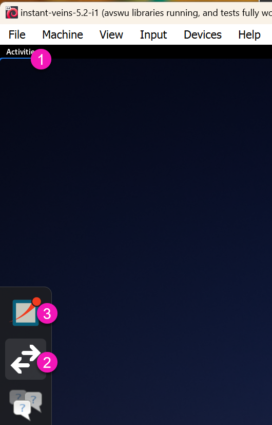
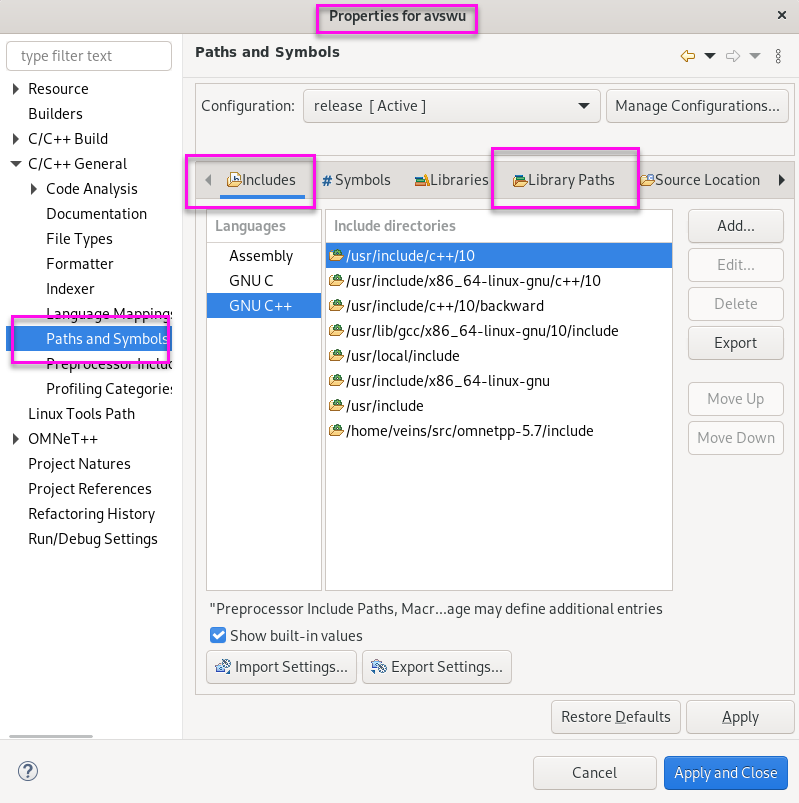
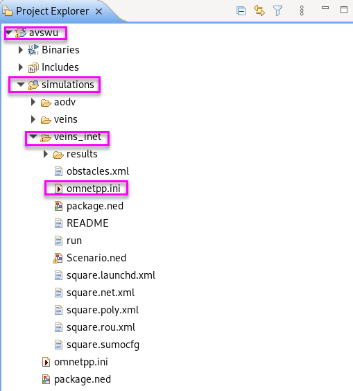
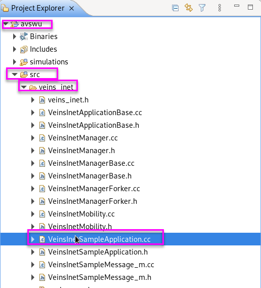
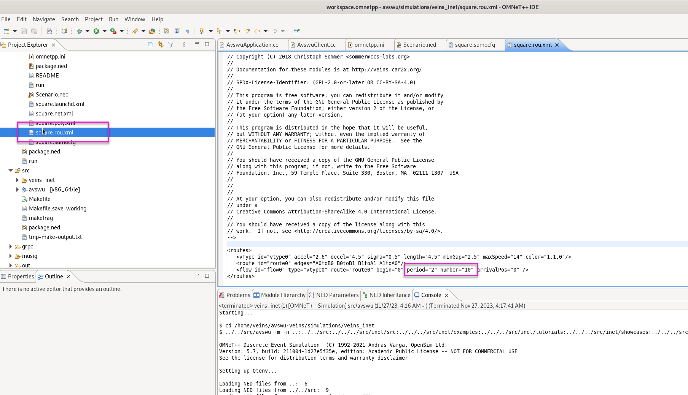

# avswu - autonomous vehicle software update

_A blockchain-based framework for autonumous vehicle software updates_

# there are two repos related to this research

avswu, https://github.com/jeromesolomon~/avswu, which contains all the technology for simulating software vehicle updates
for core libraries cpp, py, sh, and rust code

avswu-veins, https://github.com/jeromesolomon~/avswu-veins, which contains the u16 veins configuration to run the veins AV simulator. This repo runs in Oracle's VirtualBox using an Instant Veins base configuration.
for veins simulation xml, cpp, py, and sh code

## [developer workflow and commands for instant veins virtualbox](documentation/readme/instant-veins.md)

## [avswu running in a docker container](documentation/readme/docker.md)

## [polkadot, cargo, and smart contracts](documentation/readme/polkadot.md)

## how to open avswu repo and veins-avswu repo in vs code

1. Start vscode (from windows)
2. Command-shift-P
3. select Remote-SSH Connect to host
4. select ubuntu-laptop-gsolomon
5. to open repo, File->Open
    1. Veins repo, pink vscode window settings
       /home/gsolomon/avswu-veins
    2. AVSWU Core Lib Repo, orange vscode window settings
       /home/gsolomon/avswu

# vnc into ubuntu-laptop

0. prerequisites:

> sudo apt-get install tigervnc-common

vi ~/.vnc/xstartup

must be:

```bash
#!/bin/sh

unset SESSION_MANAGER
unset DBUS_SESSION_BUS_ADDRESS

export XKL_XMODMAP_DISABLE=1
export XDG_CURRENT_DESKTOP="GNOME-Flashback:GNOME"
export XDG_MENU_PREFIX="gnome-flashback-"


[ -x /etc/vnc/xstartup ] && exec /etc/vnc/xstartup
[ -r $HOME/.Xresources ] && xrdb $HOME/.Xresources
xsetroot -solid grey
vncconfig -iconic &

gnome-session
```

1.  run vncserver (on linux)

```bash
touch ~/.Xresources
vncserver -localhost no -geometry 800x600 -depth 24
```

make password is: passpass

2.  run tigervnc (on windows)

    open tiger vnc on windows to: 192.168.50.112:5901
    enter password (ubuntu linux password)

3.  run sumo (linux)

> simsumo

4. start omnet++ (linux)
    > omnetpp

# how to run avswu

## run polkadot and server on avswu veins

1.  ### ssh several terminal on ubuntu laptop (from windows)

        > ssh -p 22 gsolomon@192.168.50.112

    1. if get, ssh error "ssh: connect to host 192.168.50.112 port 22: Connection timed out"
       reboot ubunto laptop **twice if needed**

    2. login, and check ip address (from ubuntu-laptop)
        > ip addr show

2.  ### start the polkadot node (on linux)

    ```bash
    ~/avswu~/avswu-node/start-polka.sh
    ```

3.  ### start the backend server as \*root\* (on linux)

server needs to read/write to downloads dir w/o permission issues

```bash
cd ~/avswu~/avswu-server
npm start
```

4. ### start the front end (on windows)

```powershell
cd your-git-directory
cd avswu~/avswu-dapp
npm start
```

5. ### run the grpc-blockchain server, which deploys the contract

```bash
cd ~/avswu/veins-server
npm start
```

6. ### run unit test rpc calls (on linux container)

```bash
cd ~/avswu/veins-client
# run unit tests
make test
```

7. ### run non-con-musig unit integration tests (on linux container)

```bash
cd ~/avswu/veins-client
# run integration test
./bin/test_non_con_musig
```

8. ### run unit integration tests (on linux container)

```bash
cd ~/avswu/veins-client
# run integration test
./bin/test_shard
# compare output results
cmp test_data/test_data_10_shard.data output/out_100_110_121.data
# hexdump output
hexdump -C output/out_100_110_121.data
```

## run instant-veins (on virtualbox vm)

9. ### copy, compile, and test client on virtualbox vm (from instant-veins virtualbox vm)

```bash
cd /home/veins~/avswu-veins
update-veins-client.sh
cd /home/veins~/avswu-veins/veins-client
make test
bin/test_shard -v
```

10. ### if needed, configure veins (on virtualbox vm)

11.1 start sumo (veins_launchd)
11.2 start veins/omnet++

<br> 

#### veins/omnet++ include and libraies UI settings

add path to include list, and check include all configurations

> INCLUDE_PATH += -I/home/veins~/avswu-veins/veins-client/veins_avswu
> <br> 

11. ### if needed, set up veins to use use a custom Makefile (on virtualbox vm)

Properties->Omnet ++->Makemake->Custom Makefile

> <br> 

12. ### edit Makefile to add include dirs and static libraries near top as appropraite

> /home/veins~/avswu-veins/Makefile

open vscode to virtualbox vm

<br> 

13. ### to edit veins code from vs code

1. start vs code
1. ctrl-shift-P and choose ssh into remote
1. in vscode, open the folder /home/veins~/avswu-veins (which is another separate repo in github)

#### 14.1 to git commit/push to avswu-veins repo (on github.com)

git commit/push from vscode directly, or command line ssh

> git commit
> git push

use PAT (personal access token) for your password:
see: https://github.com/settings/tokens

https://stackoverflow.com/questions/68775869/message-support-for-password-authentication-was-removed

14. ### run simulation

    1. select veins_avswu
    2. click run/play button
    3. click run in sim

edit \*route\*.xml to
a. increase # of AVs
b. increase period, how often/rapidly AVs spawn

sim results go into: /home/veins~/avswu-veins/simulations/veins_inet/results

15. ### 16. to run batch simulation commands

    1. select veins_inet folder
    2. right-click Build
    3. click simulation play button

Avswu is: simulations/veins_inet folder with square route, Avswu
RSU city example: simulations/veins folder with RSU

16. ### to run batch simulation commands

aliases are in .bash_profile

> /home/veins/.bash_profile

> cd /home/veins~/avswu-veins

#### make

> simmake

#### make verbose

> simmakeverbose

#### you must start sumo in virtualbox (for sims to run)

> sumostart

#### run sim slow w/ logging

> simlog

#### run sim fast w/o logging

> simquick

#### grep sim log file

> simgrep

# create a new simulation config.json file

> bin/create_config -v

# create icons for veins/omnet

create png files as in:
put png files into: /home/veins/src/veins/images/veins/node/

# creating a new application

adapted from: https://veins.car2x.org/tutorial/

## create a new veins app

1. copy veins to new project directory name of your choise (avswu2 for example)
2. select and run example veins/examples/veins/omnetpp.ini
   <br> 
3. look at, and edit source under src/veins/modules/application/traci/
   <br> 

# to run/start avswu simulations

## 1. start ubuntu laptop and ssh into terminals

> ssh -p 22 gsolomon@192.168.50.112

## 2. start the polkadot node (on linux)

> simpolka

or

> cd ~/avswu~/avswu-node
> ./start-polka.sh

or

> ./target/release/node-template --rpc-cors all --unsafe-rpc-external --name test-node --dev

## 3. start the backend server (on linux)

> simserver

or

> cd ~/avswu~/avswu-server
> npm start

## 4. start sumo

> simsumo

or

> /home/gsolomon/src/veins/bin/veins_launchd -vv -c /home/gsolomon/src/sumo-1.11.0/bin/sumo

## 5. start omnet on ubuntu-laptop

### to build w/ clang optimized

> simmake

### to sim in batch

> simquick

### to sim in batch w/ logs

> simlog

### to grep logs for avswu

> simgrep

### to save simulations

> simsaveresults

### to start omnetpp/veins

> omnetpp

open omnetpp in /home/gsolomon/src

# erasure coding example

to run erasure code examples

> cd ~/avswu/erasure-codes/src
> make

run any of the examples

> ./bin/schifra_erasure_channel_example01
> ./bin/schifra_reed_solomon_speed_evaluation

## example to encode message, noisy channel corrupt message, decode message

> ./bin/schifra_reed_solomon_example01

## erasure encode a file

> cp sourceFile input.dat
> ./bin/schifra_reed_solomon_file_encoding_example

## erasure decode a file

> cp output.schifra input.schifra
> ./bin/schifra_reed_solomon_file_decoding_example
> cat output.decoded

## to verify erasure encode->decode

> diff input.dat output.decoded

# to run my test, rsTest1.cpp

> ~/avswu/erasure-codes/src
> make rsTest1
> ./rsTeste1

# eslint installation

from https://www.digitalocean.com/community/tutorials/linting-and-formatting-with-eslint-in-vs-code

\*be sure to choose

1. choose enforce style with eslint
2. choose the _airbnb_ style guide for React
   or
   choose _google style_ for node js

-   > npm init @eslint/config

# erasure code add-on (plugin)

cd ~/avswu/erasure-code/src/add-on

## install node-gyp build tool

npm install -g node-gyp

## to build the c++ node addon (from addon directory)

> cd ~/avswu/erasure-code/src/add-on
> npm run build

## to run tests

npm test

## to run addon.js script

npm start

# polkadot node types

> https://wiki.polkadot.network/docs/maintain-sync

## archive node

-   manufacturer = archive-node?
-   takes up more space, keeps all transaction

## full node

-   A full node is pruned: it discards all finalized blocks older than a configurable
-   number except the genesis block.
-   keeps by default 256 blocks

## light node

av's

-   A light node has only the runtime and the current state
-   does not store past blocks and so cannot read historical data without requesting it from a node that has it.
-   Light nodes are useful for resource restricted devices.

## validator node

-   A blockchain's growth comes from a genesis block, extrinsics, and events.
-   once two thirds of the validators agree on a specific block being valid, it is finalized.
-   When a validator seals block 1, it takes the blockchain's state at block 0. It then applies all pending changes on top of it, and emits the events that are the result of these changes.

# running a node on westend testnet

## westend test network

> polkadot --chain westend --name "gsolo-campbell1"

watch on polkadot's telemetry website

add westend to the polkadot chains (upper right corner of chrome)

> https://telemetry.polkadot.io/#list/0xe143f23803ac50e8f6f8e62695d1ce9e4e1d68aa36c1cd2cfd15340213f3423e

## for cloud hosted nodes, need to set up certificate

> https://wiki.polkadot.network/docs/maintain-wss

## to run a light node

> ./target/release/polkadot --light

## to run a validator node

./target/release/polkadot --validator

## running an archive node

> ./target/release/polkadot --pruning archive

# crypto

## to list all cryptosystems

```js
const ciphers = crypto.getCiphers();
console.dir(ciphers, { maxArrayLength: null });
```

# building cpabe libraries

all steps have been moved to docker file

all libraries are installed into /usr/local/lib

## install cpabe

1. unzip the zip file

    > gzip -d cpabe-0.11.tar.gz
    > tar -xvf cpabe-0.11.tar
    > mv cpabe-0.11 ~/avswu/cpabe

1.5. > cd ~/avswu/cpabe/cpabe-0.11

2. ./configure CFLAGS="-fPIC"

3. find where glib is installed

> pkg-config --cflags --libs glib-2.0

4. patch line 67 of policy_lang.y file, otherwise make will give an error and not complete (semicolon is missing)
   result: policy { final_policy = $1; }

5. make cpabe

> make LDFLAGS="-lgmp -lpbc -lcrypto -L/usr/lib/x86_64-linux-gnu -I/usr/include/glib-2.0 -I/usr/lib/x86_64-linux-gnu/glib-2.0/include -lglib-2.0 -lbswabe -lgmp -lpbc -fPIC"

6. install cpabe
    > make install

## create static library func needed for improved parsing to work

> cd ~/avswu/cpabe/cpabe-0.11
> ar rvs policy_lang.a policy_lang.o
> ar rvs common.a common.o

## if get symbol link errors, make sure C libraries are referenced as extern

> extern "C" {
> #include "policy_lang.h"
> }

# to build cpabe add-on

> cd ~/avswu/cpabe/src/add-on
> npm run build

## c++ veins code

simulation is under VeinsVM->Veins->avswu->simulations->omnetpp.ini
then right click->Run
<br>


c++ code is located under VeinsVM->Veins->avswu->src->veins_inet
<br>


# to create a compile_command.json

To generate a new compile_commands.json and a new Makefile

> cmake .

# cmake (for compile_commands.json generation)

> apt-get -y install cmake

# clang-format for vscode formatting

> apt-get -y install clang-format

# grpc

to build/configure

> https://grpc.io/docs/languages/cpp/quickstart/#install-grpc

## grpc hello world example

from https://grpc.io/docs/languages/cpp/quickstart/

> cd /usr/local/grpc/examples/cpp/helloworld
> cmake .
> make -j 4
> greeter_server
> On a different terminal, run the client:
> greeter_client

# network connections to VMs and containers

## ssh windows -> avswu docker container

to get ip address (windows)

> docker inspect -f '{{range.NetworkSettings.Networks}}{{.IPAddress}}{{end}}' avswu

> to get ip address (linux)
> ifconfig

to list and start ssh service (linux)

> service ssh status
> sudo service ssh start

copy ecdsa pub key to ~/.ssh/authorized_keys on guest VM

> ssh-keygen -t ed25519
> copy the line in id_ed25519.pub to ~/.ssh/authorized_keys on guest VM

ssh to the port forwarded setup in docker run command
(ssh to port 2222 on loopback 127.0.0.1)

> ssh -p 2222 gsolomon@127.0.0.1
> or
> ssh -p 2222 root@127.0.0.1

## ssh windows -> veins VM

_note_ need to have porforwarding in place on VirtualBox

> https://dev.to/developertharun/easy-way-to-ssh-into-virtualbox-machine-any-os-just-x-steps-5d9i

ssh to loopback w/ port that is forwarded/mapped in VirtualBox

> ssh -p 3022 veins@127.0.0.1

## ssh (avswu or veins) -> windows

to check if sshd is running on windows

> Get-Service sshd

to start sshd on windows

> Start-Service sshd

get ip address for windows

> ipconfig
> Locate a section labeled something similar to "NordLynx" or "Ethernet adapter Ethernet" or "Wireless LAN adapter Wi-Fi". Find the "IPv4 Address"
> ssh jerom@10.5.0.2

_note_ you need copy authorized keys to C:\ProgramData\ssh\administrators_authorized_keys to remove need for password, instead of C:\Users\jerom\.ssh since jerom is an administrator account

## ssh veins -> avswu

ssh to the container port on the windows ip address

> ssh -p 2222 gsolomon@10.5.0.2

## ssh avswu -> veins

ssh to the veins VM VirtualBox forwarded port on the windows ip address

> ssh -p 3022 veins@10.5.0.2

# grpc client-server tests

## grpc veins->avswu

1. (from windows) ssh into veins container
    > ssh -p 3022 veins@127.0.0.1
2. (from veins virtualbox VM) run client

```bash
cd /home/veins~/avswu-veins/grpc/helloworld
./greeter_client_avswu
```

3. (from avswu container), run server

```bash
cd ~/avswu/grpc/helloworld
./greeter_server
```

## to edit code using vscode in veins virtualbox VM

1. (from windows) start vscode
2. command-shift-P
3. select Remote-SSH Connect to host host
4. select virtualbox-veins
5. File open folder /home/veins~/avswu-veins/

## grpc veins virutalBox->avswu-nodejs

1. (from windows) ssh into virtualbox-veins

    > ssh -p 3022 veins@127.0.0.1

2. (from veins virtualbox VM) run client

```bash
cd /home/veins~/avswu-veins/grpc/helloworld
././greeter_client_non_con_musig_nodejs
```

3. (from polkadot-test container), run server

```bash
cd /polkadot-test/grpc-node/grpc-node/examples/helloworld/dynamic_codegen
./node greeter_server.js
```

## grpcs veins virtualBox->avbswu-nodejs w/ blockchain

1. (from polkadot-test)

```bash
cd /polkadot-test/veins_to_polkadot_server
```

## adding flags to compiler in eclipse

> https://stackoverflow.com/questions/47287962/adding-additional-compiler-options-in-eclipse-cdt-gnu-autotools-project

# sumo, creating roads and traffic, increasing vehicles

> netedit
> sumo-gui

## how to increase number of vehicles

> <br> > 

## to modify veins virtual box disk size, increase disk space of oracle virtualbox (from windows), to 60GiB

> https://askubuntu.com/questions/101715/resizing-virtual-drive

> & 'C:\Program Files\Oracle\VirtualBox\VBoxManage.exe' internalcommands sethduuid .\instant-veins-5.2-i1-disk002.vdi
> & 'C:\Program Files\Oracle\VirtualBox\VBoxManage.exe' modifyhd .\instant-veins-5.2-i1-disk002.vdi --resize 102400

then adjust with gparted partition tool in ubuntu

> sudo apt install gparted -y

# test non con musig

> bin/test_non_con_musig -n 50 -v

# sharding, erasure encode/decode

## encode file into directory "Coding"

k is the number of shards of size = original size / k, that will be creatred
m is the number of additional coding shards of size = original size / k
k+m is the total # of shards produced by the RS erasure encoding
m is the # of coding devices

we can have up to m erasures (loss and/or integrity loss of data)

<br>


k = 5, m = 3

> bin/encoder file 5 3 reed_sol_van 8 0 0
> bin/decoder file

## with test data, we can remove ANY 2 data files and it can still decode!

> bin/encoder test_data/test_data_10_shard.data 6 3 reed_sol_van 8 0 0
> bin/decoder test_data/test_data_10_shard.data
> cmp Coding/test_data_10_shard_decoded.data test_data/test_data_10_shard.data

## shard cache tests examples

> bin/test_shard_cache -n 100 -c 512
> bin/test_shard_cache -v -n 10

## encoder tests examples

### 1. start polkadot

> ~/avswu~/avswu-node/start-polka.sh

### 2. start gRPC server for polkadot & ipfs

> cd ~/avswu/veins-server; npm start

### 3. run the test and compare output/out.data

> bin/test_shard -i test_data/test_data_10_shard.data -v
> cmp test_data/test_data_10_shard.data output/out_100_110_121.data
> hexdump output/out_100_110_121.data

# ipfs

> cd ~/avswu/veins-server
> npm run ipfs

> cd ~/avswu/veins-client
> make test

> bin/test_shard -v

# outputting data and analizing results from omnet++

## convert data to csv

> cd ~/avswu-veins/simulations/veins_avswu/results
> scavetool x General-#0.sca -o temp-scalars.csv
> scavetool x General-#0.vec -o temp-vectors.csv

## how to collect data in .vec (vector temporal) and .sca (scalar results) files

https://docs.omnetpp.org/tutorials/tictoc/part5/

# omnetpp icons for veins

need to be copied into: /home/veins/src/veins/images/veins~/avswu_icons

1. do no set icon in .ned file
2. set icon in code only using setTagArg in initialize_stage1()
3. it seems like only "vl" or "s" sizes work in sim

```c++
  findHost()->getDisplayString().setTagArg("i", 0, "veins~/avswu_icons/rsu");
  findHost()->getDisplayString().setTagArg("is", 0, "vl");
```

# sumo gui

within virual box

> sumo-gui

File->open config.xml file

add delay or else sim runs really fast

there is a network editor in sumo-gui too

Edit->"open in netedit" to edit the network/routes/map

# ssh windows -> ubuntu laptop (ubuntu-laptop)

## 1. to get ip address (ubuntu)

look for "inet" address in output of ifconfig

> ifconfig

inet "192.168.50.112"

## 2. to list and start ssh service (ubuntu)

> sudo service ssh status
> sudo service ssh start

### to run ssh in debug mode

/usr/sbin/sshd -d -p 2222

## 3. copy ecdsa pub key from windows to ~/.ssh/authorized_keys on ubuntu

> ssh-keygen -t ed25519
> copy the line in id_ed25519.pub in ubuntu to ~/.ssh/authorized_keys on windows

ssh to the port forwarded setup in docker run command
(ssh to port 2222 on loopback 127.0.0.1)

> ssh -p 22 gsolomon@192.168.50.112
> or
> ssh -p 22 root@192.168.50.112

be sure to add to sudo group

> usermod -aG sudo gsolomon

### 4.to open vs code into ubuntu (windows)

1. start vs code
2. ctrl-shift-P and choose ssh into remote
3. File-Open Folder->~/avswu

### install compiledb to generate compile_commands.json from Makefile

> sudo pip install compiledb
> cd /home/gsolomon/avswu/veins-client
> compiledb make

# to update /home/veins~/avswu (copy/fetch to veins-virtual box from ubuntu-laptop)

> /home/veins~/avswu-veins/update-avswu.sh

# to create new routes (virtual box)

from

> https://youtu.be/J5m9VsWuy1A?t=276

1. open terminal

2. > cd /home/veins~/avswu-veins/simulations/veins_avswu
   > netedit
3. right click on lane
4. choose copy name to clipboard
5. remove \_0 (underscore 0) from end of name, if it exists
6. paste value into text editor (on virtualbox) and save each edge

two verify/check edge values

1. File->Open Network, Select \*.net.xml file
2. zoom in with wheel-mouse, hold-click to move around
3. Modes->Select Mode
4. choose edges in order the vehicles should route through
5. click save
6. copy edge points into \*rou.xml file

## random trips

> pushd /home/gsolomon/avswu-veins/simulations/veins_avswu
> ~/src/sumo-1.11.0/tools/randomTrips.py -n erlangen.net.xml -e 300 --period 0.5 --route-file trips.xml --validate --seed 123456

add to trips to \*rou.xml file
<route-files value="trips.trips.xml"/>

# polkadot error when out of blockspace???

-- optimize on server side by putting json into ipfs, and storing cid instead of json for notifications

```json
{
    "err": {
        "module": {
            "index": 8,
            "error": "0x0c000000"
        }
    }
}
```

# video recording sims

## screen recording

> ~avswu/record-veins.sh
> vlc output.mp4

## recording directly from veins

1. click on record button
2. png files stored in
    > /home/gsolomon/avswu-veins/simulations/veins_avswu/frames/Default#0_0001.png
3. convert to mp4 file
    > ffmpeg -r 30 -f image2 -i "frames/Default#0\_%04d.png" -filter:v "crop=828:566:613:118" -vcodec libx264 -pix_fmt yuv420p Default#0.mp4

# veins, to turn on/off animation of packets

File->Preferences->Animation tab

# scp file from ubuntu to windows (from windows)

> scp -r root@ubuntu-laptop:/home/gsolomon/avswu/saved-sim-results C:\Users\jerom\Downloads

> scp -r root@192.168.50.112:/home/gsolomon/avswu/saved-sim-results C:\Users\jerom\Downloads

# sumo units

https://sumo.dlr.de/docs/Vehicle_Type_Parameter_Defaults.html

-   maxSpeed in km/h
-   accel in m/s
-   map size is in meters (4000mx4000m)

## libipfs error

Error: "Unable to create IPFS node: no IPFS repo found in .libipfs-repo.\nplease run: 'ipfs init'\n"}
Action: remove .libipfs-repo. directory

# vehicle density sims

> create_avswu_trip.py -d 400 -c 600 -o avswu_trips-400dav-600cav.rou.xml
> create_avswu_trip.py -d 200 -c 300 -o avswu_trips-200dav-300cav.rou.xml
> create_avswu_trip.py -d 100 -c 150 -o avswu_trips-100dav-150cav.rou.xml

# excel function w/ temp variable for node id

> =LET(TEMP, RIGHT([@module],LEN([@module])-FIND("[",[@module])),VALUE(LEFT(TEMP,FIND("]",TEMP)-1)))

# simulation graphs pandas and matplotlib

# steps to run a sim

1. ssh to ubuntu laptop
    1. > ssh -p 22 gsolomon@192.168.50.112
2. starts sumo, polkadot, server
    1. > simsumo
    2. > simpolka
    3. > simserver
3. optional, make
    1. > simmake
4. sim
    1. > cd /home/gsolomon/avswu-veins/simulations/veins_avswu
    2. > cp trips.rou.xml file to erlangen.rou.xml
    3. > simquick
5. save sim results
    1. > cd /home/gsolomon/avswu/saved-sim-results
    2. > simsaveresults
    3. > cd /home/gsolomon/avswu/saved-sim-results
    4. > mvpre sim_results_07_29_2024_22_19_44- avswu_trips-40dav-60cav-

# to run graphs/create graphs from data (windows)

1. run vscode from windows C: drive avswu, in correct the branch

## sim results are saved in

> /home/gsolomon/avswu/saved-sim-results

# file size sim notes

for 1536 mem issue (on ubuntu)

> sysctl -w net.core.rmem_max=2500000

## to run simulations

```bash
cd /home/gsolomon/avswu-veins
simquick
```

## c++ debug additions code

```cpp
// TODO: TEMP DEBUG
string tmp = fmt::format("shard request list received from_id={}, to_id={}", from_id, to_id);
AVSWU_LOG_INFO(tmp);

// TODO: TEMP DEBUG
uint_t debug_count = 0;
AVSWU_LOG_INFO(fmt::format("handle_shard_request_list:DEBUG={}", debug_count++));

// TODO: TEMP DEBUG
uint_t debug_count = 0;
spdlog::info(fmt::format("get_request_packet_list:DEBUG={}", debug_count++));
```
